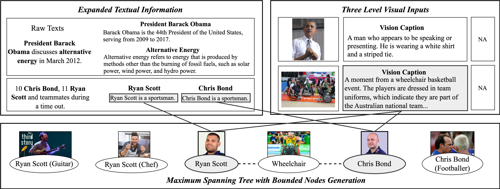
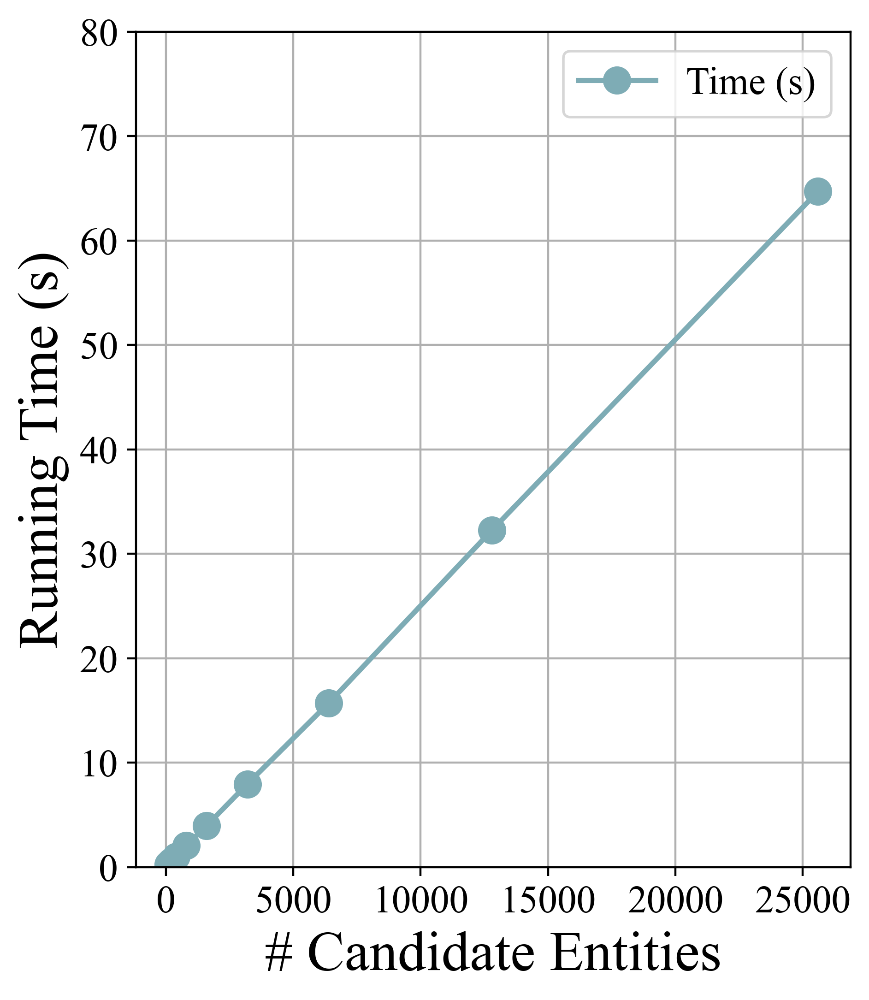

<div align="center">
<h1>OpenMEL: Unsupervised Multimodal Entity Linking Using Noise-Free Expanded Queries and Global Coherence</h1>

[](https://github.com/DAISYzxy/OpenMEL)
[](https://github.com/DAISYzxy/OpenMEL/issues)
[](https://github.com/DAISYzxy/OpenMEL/pulls)
[](https://github.com/DAISYzxy/OpenMEL/stargazers)
[](https://github.com/DAISYzxy/OpenMEL/blob/main/LICENSE)
[](https://github.com/DAISYzxy/OpenMEL)
</div>




# Contents

- [Introduction](#Introdution)
- [Installation](#Installation)
- [Test](#Test)

# Introduction

We propose a novel unsupervised learning framework, OpenMEL, for solving the MEL task. We enhance the textual modality contextual information by incorporating full context comprehension and general knowledge, and generates three levels of visual inputs for further adaptive selection to handle noise. To capture global entity coherence, we construct a tree cover structure, defining it as a maximum spanning tree with bounded nodes to meet the MEL objective. We then introduce a greedy algorithm with theoretical guarantees to solve this problem.

# Runtime Experiments

In this part, we demonstrate the experimental results on OpenMEL time complexity, as discussed at the end of Section 4 in the paper. The time complexity of OpenMEL is $O (|\mathcal{E}| \cdot \log |\mathcal{E}|)$, where $|\mathcal{E}|$ is the number of candidate entities.




As shown in the figure above, we conducted several experiments to analyze the relationship between running time (s) and the number of candidate entities on WikiDiverse dataset. In all experiments, the number of test mentions was fixed at 100. The results demonstrate that the running time does not significantly increase as the number of candidate entities grows.

# Installation
To install the cutting edge version of `OpenMEL` from the main branch of this repo, run:
```bash
git clone https://github.com/DAISYzxy/OpenMEL.git
cd OpenMEL
pip install -r requirements.txt
```
To download the test data, open the [Google Drive link](https://drive.google.com/file/d/1NdCh8DsV3h9OtW561ZLxfpuQOH5KF7xn/view?usp=sharing).


# Test
Test the performance of OpenMEL, download the test data and place it under the OpenMEL folder. Then run:
```bash
python main.py
```